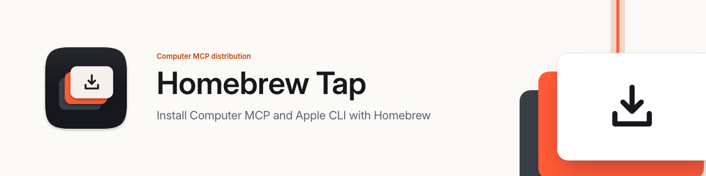

<picture>
  <source media="(prefers-color-scheme: dark)" srcset="Documentation/Brand/header-dark.png">
  
</picture>

# Computer MCP Homebrew Tap

The organization tap for Computer MCP formulae and casks.

## Install

Install directly from this tap, as recommended by
[Homebrew](https://docs.brew.sh/How-to-Create-and-Maintain-a-Tap#direct-installation-recommended):

```sh
brew install computer-mcp/tap/apple-cli
brew install --cask computer-mcp/tap/computer-mcp
```

`apple-cli` installs `apple`, `apple-cli-mcp` and their runtime libraries on
macOS 27 or newer with an Apple silicon processor. Computer MCP installs the
desktop application on macOS 14 or newer.

Run `brew update` and `brew upgrade` to receive accepted distribution updates.
Plugins and Swift SDKs use their own distribution channels.

## Maintenance

This repository was created with `brew tap-new`. `Formula/` owns CLI packages;
`Casks/` owns desktop application packages. Product repositories own their
versions, release artifacts and compatibility contracts.

The release update workflow checks published releases hourly and can also run
manually. It verifies source tags, artifact checksums and product acceptance
records, renders each package from its reviewed template in
`Scripts/templates/`, and proposes the result as a pull request from
`automation/distribution-updates` with auto-merge enabled. GitHub creates the
proposal commit through its API with the workflow token, so the commit is
signed; the workflow requires GitHub's tree to match the staged files and the
commit to be verified. Pull requests
created by the workflow token do not start other workflows, so it dispatches
the official `brew test-bot` checks and installation verification on that
branch; the pull request merges once they pass.
Stable releases take precedence; the Apple CLI preview is available while
there is no stable release. `Metadata/` records the accepted distribution inputs.

The `master` ruleset requires a pull request, both `test-bot` checks and signed
commits, and blocks force pushes and deletion, with no bypass. Pull requests
are squash-merged, which GitHub signs.

The packages install original release files. CI verifies executable signatures
and bytes for Apple CLI, and the app version, signature and notarization for
Computer MCP. Formula and Cask pull requests run the same installation checks.

Dependabot opens weekly GitHub Actions update pull requests. Review changes and
their CI results before merging.

To add a product, review its release acceptance contract, add its source to
`release-sources.json`, and implement the corresponding validation and package
template in `Scripts/`. Validate with:

```sh
python3 -B -m unittest discover -s Tests
brew test-bot --only-tap-syntax --tap=computer-mcp/tap
```
